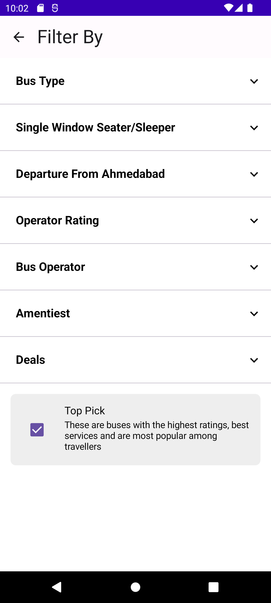
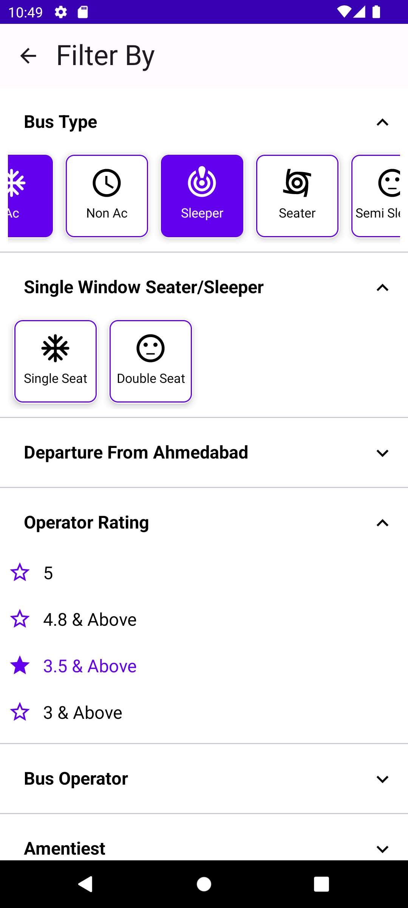
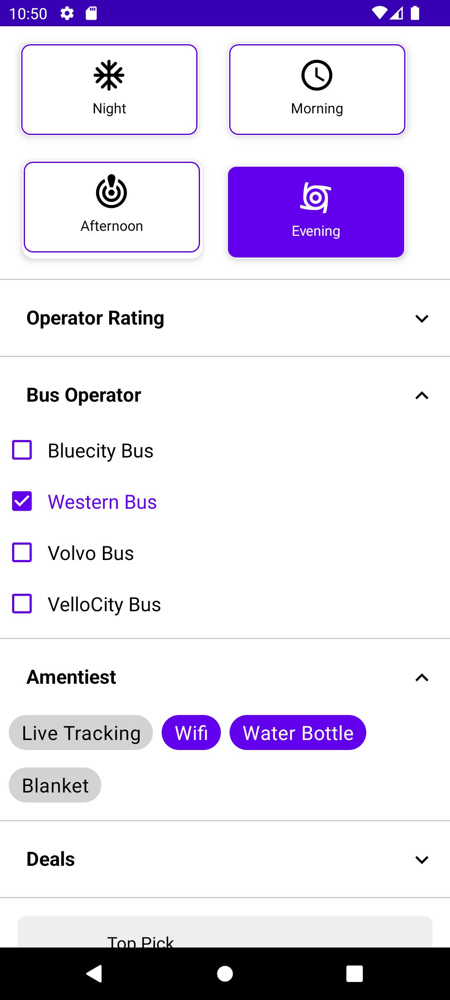
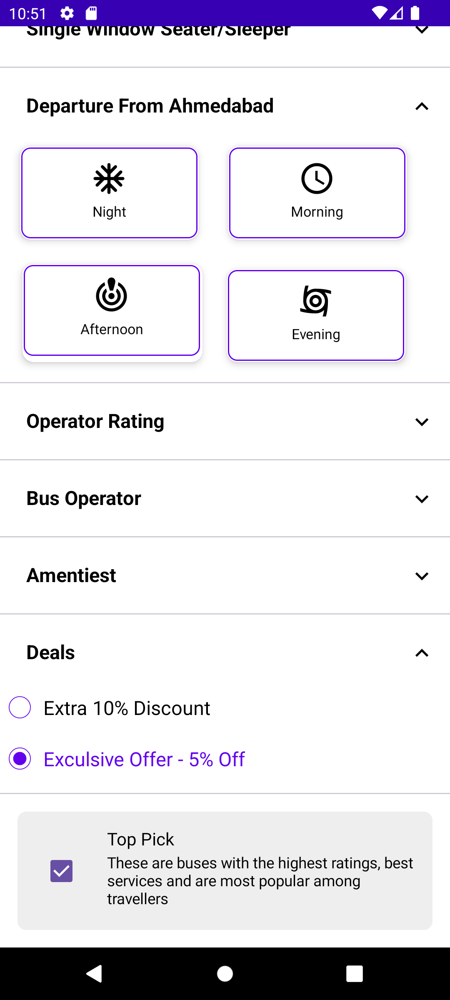

# Smart Filter Library


This library provides a set of customizable filter components for Android applications. It supports both single and multi-selection filters in various formats such as radio groups, chip groups, and list views. The filters can be displayed either vertically or horizontally.

## Features

- Single Line Radio Group (Vertical/Horizontal)
- Multi Line Radio Group
- Row Item Radio Group (Vertical/Horizontal)
- Range Selection
- Chip Group Single Selection (Vertical/Horizontal)
- Chip Group Multi Selection (Vertical/Horizontal)
- Checked Single Selection (Vertical/Horizontal)
- Checked Multi Selection (Vertical/Horizontal)

## Getting Started

These instructions will guide you on how to get a copy of the project up and running on your local machine.

## Prerequisites

Before you can run the project, you need to have Android Studio installed on your machine. You also need to have a suitable Android device or emulator for running the application.

## Installing

1. Clone the repository: `git clone https://github.com/smartSenseSolutions/smart-filter-library.git`
2. Open the project in Android Studio.
3. Build and run the project on an emulator or device.

## Usage

The library provides a set of classes and methods for creating and managing filter components. Each filter type has its own class and configuration methods. The filters can be added to any ViewGroup in your layout.

The library also provides a set of default styles for the filters. You can customize these styles by providing your own drawable and color resources.

## Dependencies

The library depends on the following libraries:

- `androidx.appcompat:appcompat:1.3.1`
- `androidx.core:core-ktx:1.6.0`


## SingleSelection

### SingleSelectionRadioGroup(Verticle/Horizontal)

- **Verticle**


                 SmartFilter.addRadioGroupSingleSelection {
                 addRadioGroupSingleLineVertical(binding.root) { radioGroupData ->
                 toast("name: ${radioGroupData.name} ") }}

                                      Or

                  <com.ss.smartfilterlib.singleselection.SingleSelectionRadioGroup              
                  android:layout_width="match_parent"
                  android:layout_height="match_parent"
                  app:rg_sl_list_item="@array/array_android_version"
                  app:rg_sl_background="@drawable/rb_selector"
                  app:rg_sl_text_color="@color/text_selector"
                  app:rg_sl_orientation="1"/>

- **Horizontal**


                  SmartFilter.addRadioGroupSingleSelection {
                  addRadioGroupSingleLineHorizontal(binding.root) { radioGroupData ->			
                  toast("name: ${radioGroupData.name} ") } }

                                      Or

                  <com.ss.smartfilterlib.singleselection.SingleSelectionRadioGroup                   
                  android:layout_width="match_parent"
                  android:layout_height="match_parent"
                  app:rg_sl_list_item="@array/array_android_version"
                  app:rg_sl_background="@drawable/rb_selector"
                  app:rg_sl_text_color="@color/text_selector"
                  app:rg_sl_orientation="0"/>


### SingleSelectionMultiLine(MultiRaw)

                     SmartFilter.addRadioMultiRawSingleSelection {
                     addRadioButtonMultiRow(binding.root) { radioGroupData ->
                     toast("name: ${radioGroupData.name} ")  } }

                                     OR

                      <com.ss.smartfilterlib.singleselection.SingleSelectionMultiLineRadioButton                  
                      android:layout_width="match_parent"
                      android:layout_height="match_parent"
                      app:rg_ml_list_item="@array/array_android_version"
                      app:rg_ml_background="@drawable/multiline_bg_selector"
                      app:rg_ml_text_selector="@color/multiline_text_selector"/>

### SingleSelectionRowItem(Verticle/Horizontal)

- **Verticle**

                      SmartFilter.addRadioRawItemSingleSelection {
                      addRadioGroupRowItemVertical(binding.root) { radioGroupData ->
                      toast("name: ${radioGroupData.name} ")  } }

                              Or

                      <com.ss.smartfilterlib.singleselection.SingleSelectionItemRadioGroup              
                      android:layout_width="match_parent"
                      android:layout_height="match_parent"
                      app:rg_ri_list_item="@array/array_android_version"
                      app:rg_ri_orientation="1"
                      app:rg_ri_text_selector="@color/text_selector"/>

  - **Horizontal**

                        SmartFilter.addRadioRawItemSingleSelection {
                        addRadioGroupRowItemHorizontal(binding.root) { radioGroupData ->
                        toast("name: ${radioGroupData.name} ")  } }

                                          Or
  
                        <com.ss.smartfilterlib.singleselection.SingleSelectionItemRadioGroup             
                        android:layout_width="match_parent"
                        android:layout_height="match_parent"
                        app:rg_ri_list_item="@array/array_android_version"
                        app:rg_ri_orientation="1"
                        app:rg_ri_text_selector="@color/text_selector"/>

### SingleSelectionChipGroup((Verticle/Horizontal))

                        SmartFilter.addChipGroupSingleSelection {
                        addSingleSelectionChipGroupVertical(binding.root) { radioGroupData ->
                        toast("name: ${radioGroupData.name} ") } }
                                      
                                         Or
  
                        <com.ss.smartfilterlib.singleselection.SingleSelectionChipGroup                
                        android:layout_width="match_parent"
                        android:layout_height="match_parent"
                        app:cg_sl_orientation="1"
                        app:cg_sl_background="@color/chip_bg_selector"
                        app:cg_sl_list_item="@array/array_android_version"
                        app:cg_sl_text_selector="@color/chip_text_selector" />

- **Horizontal**
 
                        SmartFilter.addChipGroupSingleSelection {
                        addSingleSelectionChipGroupHorizontal(binding.root) { radioGroupData ->
                        toast("name: ${radioGroupData.name} ") } }
                                              
                                            Or
                      
                        <com.ss.smartfilterlib.singleselection.SingleSelectionChipGroup                
                        android:layout_width="match_parent"
                        android:layout_height="match_parent"
                        app:cg_sl_orientation="0"
                        app:cg_sl_background="@color/chip_bg_selector"
                        app:cg_sl_list_item="@array/array_android_version"
                        app:cg_sl_text_selector="@color/chip_text_selector" />

### MultiSelectionChipGroup(MultiRaw - (Verticle/Horizontal))

- **Verticle**
              
                        SmartFilter.addChipGroupMultiSelection {
                        addMultiSelectionChipGroupVertical(binding.root) { radioGroupData ->
                         toast("Checked IDs: ${radioGroupData.joinToString(", ")}")  } }
                                             
                                                       Or
  
                          <com.ss.smartfilterlib.multiselection.MultiselectionChipGroup                          
                          android:layout_width="match_parent"
                          android:layout_height="match_parent"
                          app:cg_sl_orientation="1"
                          app:cg_sl_background="@color/chip_bg_selector"
                          app:cg_sl_list_item="@array/array_android_version"
                          app:cg_sl_text_selector="@color/chip_text_selector" />

- **Horizontal**

                          SmartFilter.addChipGroupMultiSelection {
                          addMultiSelectionChipGroupHorizontal(binding.root) { radioGroupData ->
                          toast("Checked IDs: ${radioGroupData.joinToString(", ")}")}}

                                                    Or
    
                          <com.ss.smartfilterlib.multiselection.MultiselectionChipGroup                          
                          android:layout_width="match_parent"
                          android:layout_height="match_parent"
                          app:cg_sl_orientation="1"
                          app:cg_sl_background="@color/chip_bg_selector"
                          app:cg_sl_list_item="@array/array_android_version"
                          app:cg_sl_text_selector="@color/chip_text_selector" />

### SingleSelectionListView((Verticle/Horizontal))

- **Verticle**
              
                        SmartFilter.addListViewSingleSelection {
                        addSingleSelectionListVertical(binding.root) { radioGroupData ->
                        toast("name:  " + radioGroupData.name)  } }

                                           OR
              
                        <com.ss.smartfilterlib.singleselection.SingleSelectionListView
                        android:layout_width="match_parent"
                        android:layout_height="match_parent"
                        app:ss_orientation="1"
                        app:ss_checked_selector="@drawable/multiline_bg_selector"
                        app:ss_list_item="@array/array_android_version"
                        app:ss_text_selector="@color/chip_text_selector" />
                    
  - **Horizontal**

                  SmartFilter.addListViewSingleSelection {
                  addSingleSelectionListHorizontal(binding.root) { radioGroupData ->
                  toast("name:  " + radioGroupData.name)  } }

                                    OR
  
                <com.ss.smartfilterlib.singleselection.SingleSelectionListView
                android:layout_width="match_parent"
                android:layout_height="match_parent"
                app:ss_orientation="0"
                app:ss_checked_selector="@drawable/multiline_bg_selector"
                app:ss_list_item="@array/array_android_version"
                app:ss_text_selector="@color/chip_text_selector" />

### MultiSelectionListView((Verticle/Horizontal))

- **Verticle**

              SmartFilter.addListViewMultiSelection{
              addMultiSelectionListVertical(binding.root) { radioGroupData ->
               toast("name:  " + radioGroupData)  } }
                        
                                OR

            <com.ss.smartfilterlib.multiselection.MultiSelectionListView
            android:layout_width="match_parent"
            android:layout_height="match_parent"
            app:ss_orientation="1"
            app:ss_checked_selector="@drawable/multiline_bg_selector"
            app:ss_list_item="@array/array_android_version"
            app:ss_text_selector="@color/chip_text_selector" />
  
  - **Horizontal**

              SmartFilter.addListViewMultiSelection{
              addMultiSelectionListHorizontal(binding.root) { radioGroupData ->
              toast("name:  " + radioGroupData)  } }

                                      OR
  
              <com.ss.smartfilterlib.multiselection.MultiSelectionListView
              android:layout_width="match_parent"
              android:layout_height="match_parent"
              app:ss_orientation="1"
              app:ss_checked_selector="@drawable/multiline_bg_selector"
              app:ss_list_item="@array/array_android_version"
              app:ss_text_selector="@color/chip_text_selector" />


     
      


### Dependency
```kotlin
implementation 'com.ss:smartfilterlib:1.0.0'
