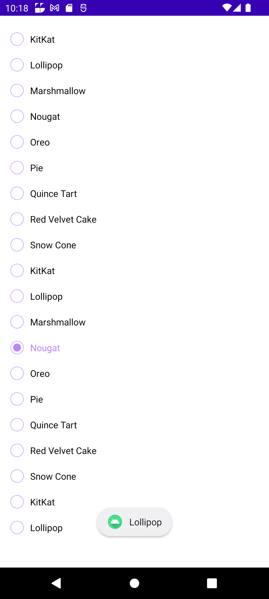
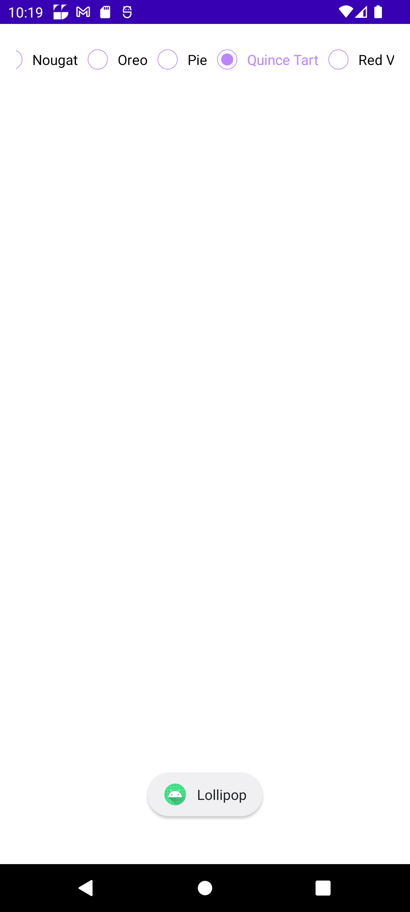
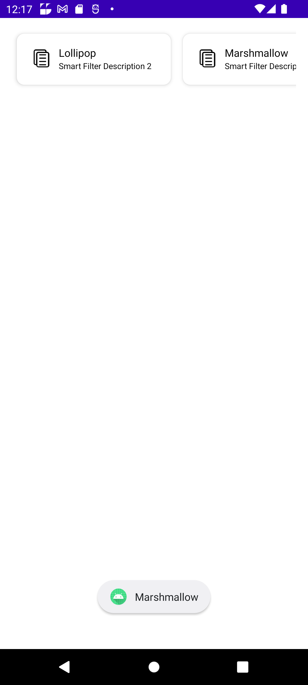

# Smart Filter Library

This is a library for creating and managing radio groups in Android. It provides support for single line, multi line and row item radio groups.

## Features

- **Single Line Radio Group**: A radio group that displays its items in a single line.
- **Multi Line Radio Group**: A radio group that displays its items in multiple lines.
- **Row Item Radio Group**: A radio group that displays its items in a row.

## Getting Started

- **These instructions will get you a copy of the project up and running on your local machine for development and testing purposes.

    ### Prerequisites

  - ** Android Studio Iguana | 2023.2.1 Patch 2 or later
  - ** JDK 8
  - ** Android SDK 24 or later

    ### Installing

  - ** Clone the repository: `git clone https://github.com/smartSenseSolutions/smart-filter-library.git`
  - ** Open the project in Android Studio.
  - ** Build and run the project on an emulator or device.

    ### Usage

  - **To use the Smart Filter library in your Android application, you need to include it in your project's dependencies. Add the following line to your `build.gradle` file:

    ### Events Handling
  - **BaseEventListener** is an interface that provides a set of methods to handle events in the Smart Filter library. You can implement this interface in your activity or fragment to handle these events. The following events are available:

  - **onSingleSelectionChanged**: This method is called when the selected item in a single selection radio group is changed.
  - **onMultiSelectionChanged**: This method is called when the selected item in a multi selection radio group is changed.
  - **onChipSelected**: This method is called when a chip is selected in a chip group.
  - **onChipUnselected**: This method is called when a chip is unselected in a chip group.


## SingleSelection

  - **SingleSelectionRadioGroup(Verticle/Horizontal)
  
     ```kotlin              
      SmartFilter.addSingleSelectionRadioGroup(addSingleSelectionRadioGroup(binding.root, this))
        
    - **Params
      ```kotlin
              fun SingleSelectionRadioData(rootView: ViewGroup, callback: BaseEventListener) =
             SingleSelectionParams(
             rootView = rootView,
             singleGroupSubType = SingleGroupSubType.SINGLE_LINE,
             orientation = Orientation.VERTICAL,
             mData = mRadioGroupData(),
             callbacks = callback,
             bgSelector = R.drawable.singleline_selector,
             textSelector = R.color.single_text_color_selector
         )
    
   - **Verticle && Horizontal
        
      ```kotlin
          orientation = Orientation.VERTICAL,/ orientation = Orientation.HORIZONTAL,

     


  - ** SingleSelectionMultiLine(MultiRaw)
       
        SmartFilter.addSingleSelectionRadioGroup(singleSelectionMultiLine(binding.root, this))

    - **Params
    ```kotlin
      fun singleSelectionMultiLine(rootView: ViewGroup, callback: BaseEventListener) =
      SingleSelectionParams(
      rootView = rootView,
      singleGroupSubType = SingleGroupSubType.MULTI_LINE,
      mData = mRadioGroupData(),
      callbacks = callback,
      bgSelector = R.drawable.multiline_bg_selector,
      textSelector = R.color.multiline_text_selector
      )   
    
  

  - ** SingleSelectionRowItem(Verticle/Horizontal)
           
        SmartFilter.addSingleSelectionRadioGroup(singleSelectionRowItem(binding.root, this))
    
     - **Params
     ```kotlin
        fun singleSelectionRowItem(rootView: ViewGroup, callback: BaseEventListener) =
        SingleSelectionParams(
        rootView = rootView,
        singleGroupSubType = SingleGroupSubType.ROW_ITEM,
        orientation = Orientation.VERTICAL,
        mData = mRadioGroupData(),
        callbacks = callback,
        bgSelector = R.drawable.rowitem_bg_selector,
        textSelector = R.color.rowitem_text_selector
        )
    
    
    

- ** SingleSelectionChipGroup(MultiRaw)
           
        SmartFilter.addSingleSelectionRadioGroup(singleSelectionChipGroup(binding.root, this))
    
     - **Params
     ```kotlin
        fun singleSelectionChipGroup(rootView: ViewGroup, callback: BaseEventListener) =
        SingleSelectionParams(
        rootView = rootView,
        singleGroupSubType = SingleGroupSubType.CHIP_GROUP,
        orientation = Orientation.VERTICAL,
        mData = mRadioGroupData(),
        callbacks = callback,
        bgSelector = R.drawable.chipgroup_bg_selector,
        textSelector = R.color.chipgroup_text_selector
        )
    
    
  

- ** SingleSelectionChipGroup(MultiRaw)

        SmartFilter.addSingleSelectionRadioGroup(singleSelectionChipGroup(binding.root, this))
    
     - **Params
     ```kotlin
        fun singleSelectionChipGroup(rootView: ViewGroup, callback: BaseEventListener) =
        SingleSelectionParams(
        rootView = rootView,
        singleGroupSubType = SingleGroupSubType.CHIP_GROUP,
        orientation = Orientation.VERTICAL,
        mData = mRadioGroupData(),
        callbacks = callback,
        bgSelector = R.drawable.chipgroup_bg_selector,
        textSelector = R.color.chipgroup_text_selector
        )


  

- ** MultiSelectionChipGroup(MultiRaw)
        
            SmartFilter.addChipGroupMultiSelection(multiSelectionChipGroup(binding.root, this))
         
    - **Params
  
          ```kotlin
              fun multiSelectionChipGroup(rootView: ViewGroup, callback: BaseEventListener) =
              SingleSelectionParams(
              rootView = rootView,
              singleGroupSubType = SingleGroupSubType.MULTI_SELECTION_CHIP_GROUP,
              orientation = Orientation.VERTICAL,
              mData = mRadioGroupData(),
              callbacks = callback,
              bgSelector = R.drawable.chipgroup_bg_selector,
              textSelector = R.color.chipgroup_text_selector
              )
    
      

### Attribute      
         
    | Attribute | Description | Type | Default Value |
    | --- | --- | --- | --- |
    | rootView | The root view of the radio group. | ViewGroup | - |
    | singleGroupSubType | The type of the radio group. | SingleGroupSubType | - |
    | orientation | The orientation of the radio group. | Orientation | VERTICAL |
    | mData | The list of radio group items. | List<RadioGroupData> | - |
    | callbacks | The event listener for the radio group. | BaseEventListener | - |
    | bgSelector | The background selector for the radio group items. | Int | - |
    | textSelector | The text color selector for the radio group items. | Int | - |
     
 
### Default Drawable for SingleSelectionRadioGroup

        @DrawableRes val bgSelector: Int = androidx.appcompat.R.drawable.abc_btn_radio_material,
        @ColorRes val textSelector: Int = android.R.color.black

##Selector

         bgSelector = R.drawable.singleline_rb_selector,
        textSelector = R.color.single_text_color_selector

###  Drawable for SingleSelectionMultiRaw

##Default
       
         ```kotlin
        @DrawableRes val bgSelector: Int = R.drawable.multiline_default,
        @ColorRes val textSelector: Int = android.R.color.black

##Selector  

            ```kotlin    
            bgSelector = R.drawable.multiline_selector,
            textSelector = R.color.multiline_text_selector


## Events Handling
**BaseEventListener** is an interface that provides a set of methods to handle events in the Smart Filter library. You can implement this interface in your activity or fragment to handle these events. The following events are available:

- **onSingleSelectionChanged**: This method is called when the selected item in a single selection radio group is changed.
- **onMultiSelectionChanged**: This method is called when the selected item in a multi selection radio group is changed.
- **onChipSelected**: This method is called when a chip is selected in a chip group.
- **onChipUnselected**: This method is called when a chip is unselected in a chip group.

## Different methods to call from MainActivity to call single and multi line radio group ,chip group and row item radio group
```kotlin
SmartFilter.addRadioGroupSingleLineVertical(addRadioGroupSingleLineVertical(binding.root, this)) //verticle single line
SmartFilter.addRadioGroupMultiline(addRadioGroupMultiline(binding.root, this))
SmartFilter.addRadioGroupHorizontalRow(addRadioGroupHorizontalRow(binding.root, this)) //verticle row 
SmartFilter.addChipGroupMultiSelection(addMultiSelectionChipGroup(binding.root, this))
SmartFilter.addChipGroupSingleSelection(addSingleSelectionChipGroup(binding.root, this)) //verticle and horizontal single line


          fun addRadioGroupSingleLineVertical(rootView: ViewGroup, callback: BaseEventListener) =
          SingleSelectionParams(
          rootView = rootView,
          singleGroupSubType = SingleGroupSubType.SINGLE_LINE,
          orientation = Orientation.VERTICAL,
          mData = mRadioGroupData(),
          callbacks = callback,
          bgSelector = R.drawable.singleline_selector,
          textSelector = R.color.single_text_color_selector
          )
        
        
        fun addRadioGroupMultiline(rootView: ViewGroup, callback: BaseEventListener) =
        SingleSelectionParams(
        rootView = rootView,
        singleGroupSubType = SingleGroupSubType.MULTI_LINE,
        mData = mRadioGroupData(),
        callbacks = callback,
        bgSelector = R.drawable.multiline_bg_selector,
        textSelector = R.color.multiline_text_selector
        )
        
        fun addRadioGroupHorizontalRow(rootView: ViewGroup,callback: BaseEventListener) =
        SingleSelectionParams(
        rootView = rootView,
        singleGroupSubType = SingleGroupSubType.ROW_ITEM,
        orientation = Orientation.HORIZONTAL,
        mData = mRadioGroupData(),
        callbacks = callback,
        bgSelector = R.drawable.multiline_bg_selector,
        textSelector = R.color.multiline_text_selector
        )
        

| Attribute          | Description                                        | Type                | Default Value |
|--------------------|-------------------------------------------------   |---------------------|---------------|
| rootView           | The root view of the radio group.                  | ViewGroup           | -             |
| singleGroupSubType | The type of the radio group.                       | SingleGroupSubType  | -             |
| orientation        | The orientation of the radio group.                | Orientation         | VERTICAL      |
| mData              | The list of radio group items.                     | List<RadioGroupData>| -             |
| callbacks          | The event listener for the radio group.            | BaseEventListener   | -             |
| bgSelector         | The background selector for the radio group items. | Int                 | -             |
| textSelector       | The text color selector for the radio group items. | Int                 | -             |
 
 

```kotlin
implementation 'com.ss:smartfilterlib:1.0.0'