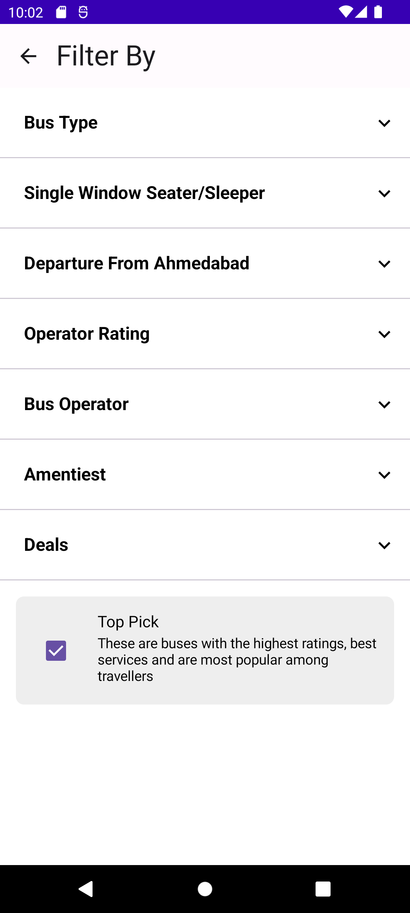
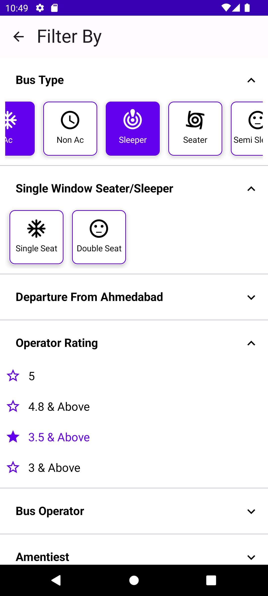
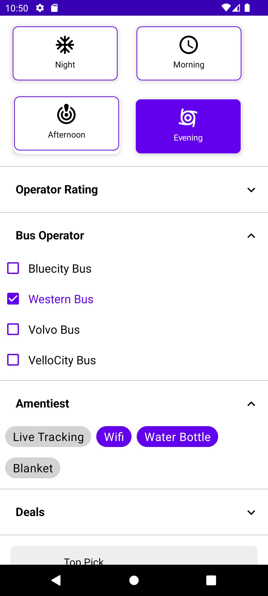
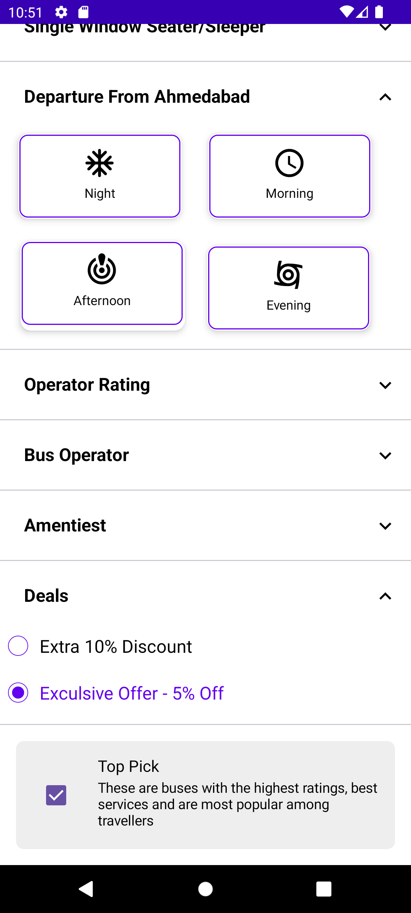

# SmartFilter

[](https://android-arsenal.com/details/3/8270) [](https://android-arsenal.com/api?level=21) [](https://developer.android.com/index.html) [](https://opensource.org/licenses/Apache-2.0)


It is an Android Filter Component developed in Kotlin, available for Jetpack Compose as well. It offers multiple customization attributes to create a smart filter based on your requirements.

## Demo


     
     

## Setup

Add the Maven Central repository to your project's root ```build.gradle``` file
``` gradle
allprojects {
    repositories {
        mavenCentral()
    }
}
```

Add the dependency in your app ```build.gradle``` file:
``` gradle
implementation 'io.github.smartsensesolutions:smartFilter:1.0.0'
```

## Usage

The library provides a set of classes and methods for creating and managing filter components. Each filter type has its own class and configuration methods. The filters can be added to any ViewGroup in your layout.

The library also provides a set of method where you can se your data.

## Features

- Single Line Radio Group (Vertical/Horizontal)
- Multi Line Radio Group (Multi Raw - Horizontal)
- Row Item Radio Group (Vertical/Horizontal)
- Chip Group Single Selection (Vertical/Horizontal)
- Chip Group Multi Selection (Vertical/Horizontal)
- Checked Single Selection (Vertical/Horizontal)
- Checked Multi Selection (Vertical/Horizontal)

## Use the view in your Activity and Layout by declaring
## SingleSelection

### SingleSelectionRadioGroup(Verticle/Horizontal)

- **Vertical**

``` #### activity

                 SmartFilter.addRadioGroupSingleSelection {
                 addRadioGroupSingleLineVertical(binding.root) { radioGroupData ->
                 toast("name: ${radioGroupData.name} ") }}
```
                                      
``` ### layout.xml
                 <com.ss.smartfilterlib.singleselection.SingleSelectionRadioGroup              
                 android:layout_width="match_parent"
                 android:layout_height="match_parent"
                 app:rg_sl_list_item="@array/array_android_version"
                 app:rg_sl_background="@drawable/rb_selector"
                 app:rg_sl_text_color="@color/text_selector"
                 app:rg_sl_orientation="1"/>
```

- **Horizontal**

```activity
                 
                 SmartFilter.addRadioGroupSingleSelection {
                 addRadioGroupSingleLineHorizontal(binding.root) { radioGroupData ->			
                 toast("name: ${radioGroupData.name} ") } }
```

```layout.xml
                 <com.ss.smartfilterlib.singleselection.SingleSelectionRadioGroup                   
                 android:layout_width="match_parent"
                 android:layout_height="match_parent"
                 app:rg_sl_list_item="@array/array_android_version"
                 app:rg_sl_background="@drawable/rb_selector"
                 app:rg_sl_text_color="@color/text_selector"
                 app:rg_sl_orientation="0"/>
```

### SingleSelectionMultiLine(MultiRaw)

```activity
                 SmartFilter.addRadioMultiRawSingleSelection {
                 addRadioButtonMultiRow(binding.root) { radioGroupData ->
                 toast("name: ${radioGroupData.name} ")  } }
```
                                        
```layout.xml
                 <com.ss.smartfilterlib.singleselection.SingleSelectionMultiLineRadioButton                  
                 android:layout_width="match_parent"
                 android:layout_height="match_parent"
                 app:rg_ml_list_item="@array/array_android_version"
                 app:rg_ml_background="@drawable/multiline_bg_selector"
                 app:rg_ml_text_selector="@color/multiline_text_selector"/>
```

### SingleSelectionRowItem(Verticle/Horizontal)

- **Vertical**

```activity
                 SmartFilter.addRadioRawItemSingleSelection {
                 addRadioGroupRowItemVertical(binding.root) { radioGroupData ->
                 toast("name: ${radioGroupData.name} ")  } }
```

```layout.xml
                 <com.ss.smartfilterlib.singleselection.SingleSelectionItemRadioGroup              
                 android:layout_width="match_parent"
                 android:layout_height="match_parent"
                 app:rg_ri_list_item="@array/array_android_version"
                 app:rg_ri_orientation="1"
                 app:rg_ri_text_selector="@color/text_selector"/>
```

- **Horizontal**

```activity
                  SmartFilter.addRadioRawItemSingleSelection {
                  addRadioGroupRowItemHorizontal(binding.root) { radioGroupData ->
                  toast("name: ${radioGroupData.name} ")  } }
```

```layout.xml  
                  <com.ss.smartfilterlib.singleselection.SingleSelectionItemRadioGroup             
                  android:layout_width="match_parent"
                  android:layout_height="match_parent"
                  app:rg_ri_list_item="@array/array_android_version"
                  app:rg_ri_orientation="1"
                  app:rg_ri_text_selector="@color/text_selector"/>
```

### SingleSelectionChipGroup((Verticle/Horizontal))

```activity
                   SmartFilter.addChipGroupSingleSelection {
                   addSingleSelectionChipGroupVertical(binding.root) { radioGroupData ->
                   toast("name: ${radioGroupData.name} ") } }
```                                      

```layout.xml   
                   <com.ss.smartfilterlib.singleselection.SingleSelectionChipGroup                
                   android:layout_width="match_parent"
                   android:layout_height="match_parent"
                   app:cg_sl_orientation="1"
                   app:cg_sl_background="@color/chip_bg_selector"
                   app:cg_sl_list_item="@array/array_android_version"
                   app:cg_sl_text_selector="@color/chip_text_selector" />
```

- **Horizontal**

```activity 
                    SmartFilter.addChipGroupSingleSelection {
                    addSingleSelectionChipGroupHorizontal(binding.root) { radioGroupData ->
                    toast("name: ${radioGroupData.name} ") } }
```                                              

```layout.xml                       
                    <com.ss.smartfilterlib.singleselection.SingleSelectionChipGroup                
                    android:layout_width="match_parent"
                    android:layout_height="match_parent"
                    app:cg_sl_orientation="0"
                    app:cg_sl_background="@color/chip_bg_selector"
                    app:cg_sl_list_item="@array/array_android_version"
                    app:cg_sl_text_selector="@color/chip_text_selector" />
```

### MultiSelectionChipGroup(MultiRaw - (Verticle/Horizontal))

- **Vertical**

```activity              
                    SmartFilter.addChipGroupMultiSelection {
                    addMultiSelectionChipGroupVertical(binding.root) { radioGroupData ->
                    toast("Checked IDs: ${radioGroupData.joinToString(", ")}")  } }
```                                             

```layout.xml    
                    <com.ss.smartfilterlib.multiselection.MultiselectionChipGroup                          
                    android:layout_width="match_parent"
                    android:layout_height="match_parent"
                    app:cg_sl_orientation="1"
                    app:cg_sl_background="@color/chip_bg_selector"
                    app:cg_sl_list_item="@array/array_android_version"
                    app:cg_sl_text_selector="@color/chip_text_selector" />
```

- **Horizontal**

```activity 
                     SmartFilter.addChipGroupMultiSelection {
                     addMultiSelectionChipGroupHorizontal(binding.root) { radioGroupData ->
                     toast("Checked IDs: ${radioGroupData.joinToString(", ")}")}}
```

```layout.xml      
                     <com.ss.smartfilterlib.multiselection.MultiselectionChipGroup                          
                     android:layout_width="match_parent"
                     android:layout_height="match_parent"
                     app:cg_sl_orientation="1"
                     app:cg_sl_background="@color/chip_bg_selector"
                     app:cg_sl_list_item="@array/array_android_version"
                     app:cg_sl_text_selector="@color/chip_text_selector" />
```

### SingleSelectionListView((Verticle/Horizontal))

- **Vertical**

```activity         
      
                      SmartFilter.addListViewSingleSelection {
                      addSingleSelectionListVertical(binding.root) { radioGroupData ->
                      toast("name:  " + radioGroupData.name)  } }
```

```layout.xml                                        
                       
                       <com.ss.smartfilterlib.singleselection.SingleSelectionListView
                       android:layout_width="match_parent"
                       android:layout_height="match_parent"
                       app:ss_orientation="1"
                       app:ss_checked_selector="@drawable/multiline_bg_selector"
                       app:ss_list_item="@array/array_android_version"
                       app:ss_text_selector="@color/chip_text_selector" />
``` 

- **Horizontal**
```activity    
                    
                      SmartFilter.addListViewSingleSelection {
                      addSingleSelectionListHorizontal(binding.root) { radioGroupData ->
                      toast("name:  " + radioGroupData.name)  } }
```

```layout.xml   
                      <com.ss.smartfilterlib.singleselection.SingleSelectionListView
                      android:layout_width="match_parent"
                      android:layout_height="match_parent"
                      app:ss_orientation="0"
                      app:ss_checked_selector="@drawable/multiline_bg_selector"
                      app:ss_list_item="@array/array_android_version"
                      app:ss_text_selector="@color/chip_text_selector" />
```

### MultiSelectionListView((Verticle/Horizontal))

- **Vertical**

```activity 
                        SmartFilter.addListViewMultiSelection{
                        addMultiSelectionListVertical(binding.root) { radioGroupData ->
                        toast("name:  " + radioGroupData)  } }
 ```                       

```layout.xml  
                        <com.ss.smartfilterlib.multiselection.MultiSelectionListView
                        android:layout_width="match_parent"
                        android:layout_height="match_parent"
                        app:ss_orientation="1"
                        app:ss_checked_selector="@drawable/multiline_bg_selector"
                        app:ss_list_item="@array/array_android_version"
                        app:ss_text_selector="@color/chip_text_selector" />
 ```
  
- **Horizontal**

```activity 
                        SmartFilter.addListViewMultiSelection{
                        addMultiSelectionListHorizontal(binding.root) { radioGroupData ->
                        toast("name:  " + radioGroupData)  } }
 ```

```layout.xml    
                        <com.ss.smartfilterlib.multiselection.MultiSelectionListView
                        android:layout_width="match_parent"
                        android:layout_height="match_parent"
                        app:ss_orientation="1"
                        app:ss_checked_selector="@drawable/multiline_bg_selector"
                        app:ss_list_item="@array/array_android_version"
                        app:ss_text_selector="@color/chip_text_selector" />
 ```

## Attributes

Following are the various attributes available to customize the look and feel of the smartFilter.

## SingleLineRadioGroup:

**rg_sl_orientation:** Orientation of the radio group, specified as an integer.

**rg_sl_background:** Background reference for the radio group.

**rg_sl_text_color:** Text color for the radio group.

**rg_sl_list_item:** List item for the radio group, specified as a string.


## MultiLineRadioGroup:

**rg_ml_spancount:**  Number of columns in the multi-line radio group, specified as an integer.

**rg_ml_spacing:** Spacing between items in the multi-line radio group, specified as an integer.

**rg_ml_background:** Background reference for the multi-line radio group.

**rg_ml_text_selector:** Text color selector for the multi-line radio group.

**rg_ml_includeedge:** Whether the spacing includes the edges, specified as a boolean.

**rg_ml_list_item:** List item for the multi-line radio group, specified as a reference.


## RowItemRadioGroup:

**rg_ri_background:** Background reference for the row item radio group.

**rg_ri_text_selector:** Text color selector for the row item radio group.

**rg_ri_orientation:** Orientation of the row item radio group, specified as an integer.

**rg_ri_list_item:** List item for the row item radio group, specified as a reference.


## SingleLineChipGroup:

**cg_sl_background:** Background reference for the single line chip group.

**cg_sl_text_selector:** Text color selector for the single line chip group.

**cg_sl_orientation:** Orientation of the single line chip group, specified as an integer.

**cg_sl_list_item:** List item for the single line chip group, specified as a reference.


## SingleSelectionView:

**ss_text_selector:** Text color selector for the single selection view.

**ss_orientation:** Orientation of the single selection view, specified as an integer.

**ss_checked_selector:** Checked state background reference for the single selection view.

**ss_list_item:** List item for the single selection view, specified as a reference.


## MAD (Modern Android Development) Scorecard

 
