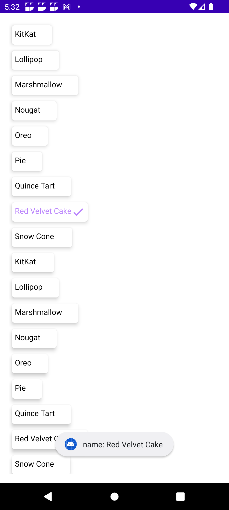
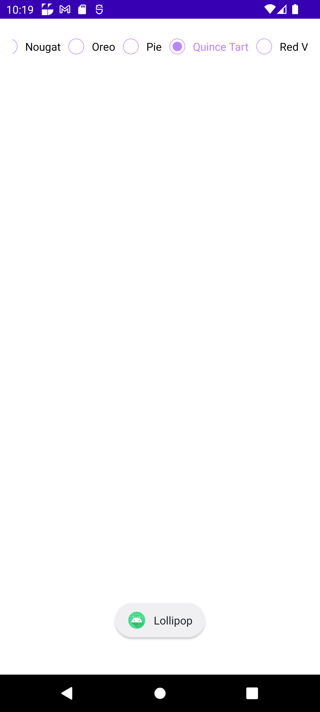
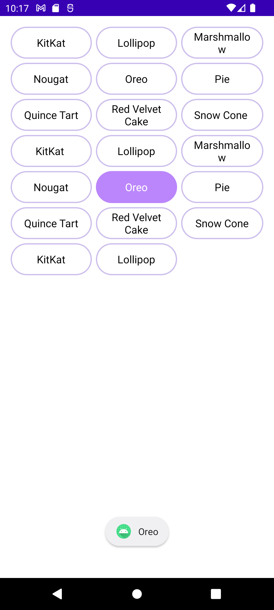
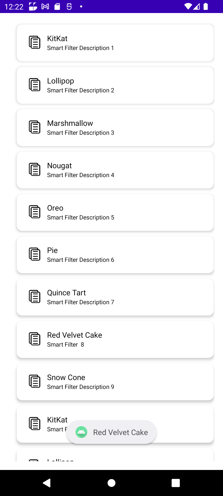
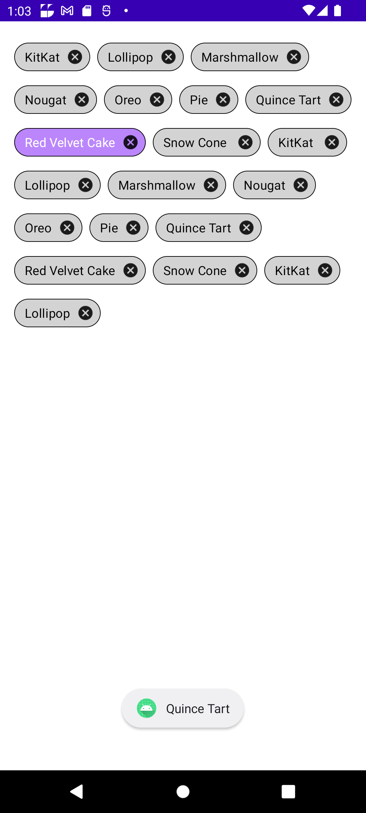
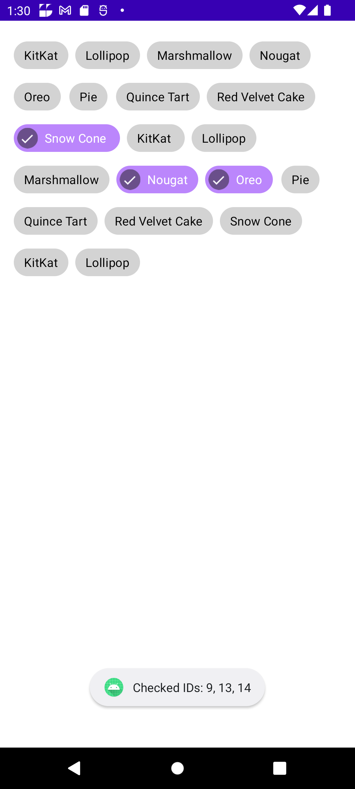

# Smart Filter Library

This is a library for creating and managing ....

## Features

	- Single Line Radio Group(Verticle/Horizontal)
	- Multi Line Radio Group
	- Row Item Radio Group(Verticle/Horizontal)
	- Range Selection
	- Chip Group Single Selection(Verticle/Horizontal)
	- Chip Group Multi Selection(Verticle/Horizontal)
	- Checked Single Selection(Verticle/Horizontal)
	- Checked multi Selection(Verticle/Horizontal)
  
## Getting Started

	These instructions will get you a copy of the project up and running on your local machine

## Prerequisites

  
  
## Installing

  - **Clone the repository: `git clone https://github.com/smartSenseSolutions/smart-filter-library.git`**
  - **Open the project in Android Studio.**
  - **Build and run the project on an emulator or device.**


## SingleSelection

  ### SingleSelectionRadioGroup(Verticle/Horizontal)
    
   - **Verticle**   
         
                   
          SmartFilter.addRadioGroupSingleSelection {
                addRadioGroupSingleLineVertical(binding.root) { radioGroupData ->
                      toast("name: ${radioGroupData.name} ") }}
       


      
   - **Horizontal**

     
      
            SmartFilter.addRadioGroupSingleSelection {
                  addRadioGroupSingleLineHorizontal(binding.root) { radioGroupData ->			
                        toast("name: ${radioGroupData.name} ") } }
    
         

           

### SingleSelectionMultiLine(MultiRaw)
       
           SmartFilter.addRadioMultiRawSingleSelection {
                addRadioMultiRow(binding.root) { radioGroupData ->
                    toast("name: ${radioGroupData.name} ")  } }
		    




### SingleSelectionRowItem(Verticle/Horizontal)

   - **Verticle**
        
            SmartFilter.addRadioRawItemSingleSelection {
                  addRadioGroupRowItemVertical(binding.root) { radioGroupData ->
                      showMessage(radioGroupData) } }

       
   

   - **Horizontal**
  
          SmartFilter.addRadioRawItemSingleSelection {
                  addRadioGroupSingleLineHorizontal(binding.root) { radioGroupData ->
                      toast("name: ${radioGroupData.name} ")  } }
     

   

### SingleSelectionChipGroup((Verticle/Horizontal))

              SmartFilter.addChipGroupSingleSelection {
                  addSingleSelectionChipGroup(binding.root) { radioGroupData ->
                      toast("name: ${radioGroupData.name} ") } }
     
        
       
   
### MultiSelectionChipGroup(MultiRaw)
        
                SmartFilter.addChipGroupMultiSelection {
                    addMultiSelectionChipGroup(binding.root) { radioGroupData ->
                         toast("Checked IDs: ${radioGroupData.joinToString(", ")}")  } }
         
             
   


### Attribute      
         
    | Attribute | Description | Type | Default Value |
    | --- | --- | --- | --- |
    | rootView | The root view of the radio group. | ViewGroup | - |
    | singleGroupSubType | The type of the radio group. | SingleGroupSubType | - |
    | orientation | The orientation of the radio group. | Orientation | VERTICAL |
    | mData | The list of radio group items. | List<RadioGroupData> | - |
    | callbacks | The event listener for the radio group. | BaseEventListener | - |
    | bgSelector | The background selector for the radio group items. | Int | - |
    | textSelector | The text color selector for the radio group items. | Int | - |

### Usage

  - **To use the Smart Filter library in your Android application, you need to include it in your project's dependencies. Add the following line to your `build.gradle` file:**
 
### Dependency

```kotlin
implementation 'com.ss:smartfilterlib:1.0.0'
